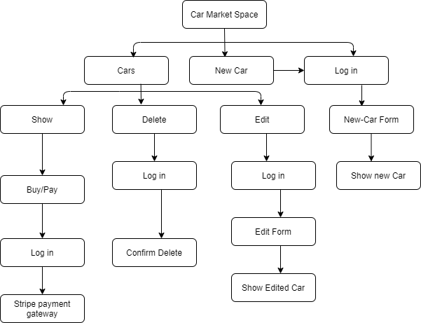

# **Introduction**
This is a market web application for buyers and sellers of cars. A user can register oneself and then buy a car posted by other users. Also, a user can post an advertisement of his/her car. In addition, non-registered users can see the car lists and the car details.

# **Motivation/Objective**
Even though we have so many market place applications like Ebay, Amazon and gumtree, Ebay and Amazon are not suitable for car sales. Also, people can post car advertisements in gumtree which we can see quite often, but, they can't make the payment via gumtree. So, I decided to design a marketplace application so that it is specialized in cars only and a user can also buy the car online by making online payment.

# **Description of the application**
### **Purpose**: 
The sole purpose of this web application is to facilitate the user in order to buy or sell personal vehicles of different models, make, body and otehr features.

### **Functionality / features:**
 A user is capable of chosing a car from the lists of acars put on the adverstisement. The main features include the following:

a. listing a car in advertisement via a form which contains different input fields for the creation of a new list of car.

b. The user can upload image of the car as well via active storage and the use of AWS S3 bucket.

c. The user can buy the car he/she likes via online payment redirecting to stripe gateway.

d. Search Engine: The user can filter cars on the basis of make, model, cost and body type.

e. Dropdown list for body-type makes it easy to view different shapes of car and select the desired one.

### **Sitemap:**
The overall site map for the application is presented below:

- Screenshots
### **Target audience**
Obviously, since cars are mostly used by adults, adults are the target audience (24 - 55 years old). So all the people who use private vehicle are focussed in the design of this application.
### **Tech stack (e.g. html, css, deployment platform, etc)**
The application uses .html.erb, Scss, bootstrap for the frontend related tasks. For the backend purpose, it uses Ryby on Rails and Psotgresql. Git has been used for version control and Heroku is the deployment platform for this application.

# **User Stories**

# **Wireframes**

## **R15	Explain the different high-level components (abstractions) in your app**
Following are the high-level compomnents in mu car_marekt_space application:
**a. Cars:**
This component includes the details of a car put on the advertisement list. It isa actually the list of cars added to the list of cars.

**Users:**
Users are all those people who are registered as a member in the application. In this case, all the people who want to put their car on advertisement and those who want to buy one of the listed cars are users.

**lists:**
This component is associated with the body-types of cars. Different body types are fed to the table named lists which may be Sedan, Suv, Ute, Mini-Vans etc.

**Active Storage:**
This storage is for enabling the user to upload photo from her/his own storage. Moreover, a user can have a bucket in amazon and store the picture over there.

## **R16	Detail any third party services that your app will use**
This application uses Stripe for payment gateway. When a user is logged in and wants to [urchase a car of his/her choice, payment can be made via Stripe and the user is required to have all the credit/debit card details in order to make the payment and purchase the desired car. Any guest users are not capable of buying the listed car despite being able to view the car.

## **R17	Describe your projects models in terms of the relationships (active record associations) they have with each other**
In this marketplace application, following are the different model entities:
a. Car
b. User
c. List

Car is the most important model in this app and it is associated with user and List. List is for storing different body types of cars like Sedan, Suv, Ute and much more. 

A list belongs to a user and a user have zero or multiple cars. 
A list has many cars and a car belongs to one list only.

Also, for enabling the user to use active storage via AWS bucket, there are two tables named active_storage_attachments and active_storage_blobs.

## **R18	Discuss the database relations to be implemented in your application**
This application uses Postgresql and Ruby on Rails. 
### **One to 

## **R19	Provide your database schema design**

## **R20	Describe the way tasks are allocated and tracked in your project**

This README would normally document whatever steps are necessary to get the
application up and running.

Things you may want to cover:

* Ruby version

* System dependencies

* Configuration

* Database creation

* Database initialization

* How to run the test suite

* Services (job queues, cache servers, search engines, etc.)

* Deployment instructions

* ...
