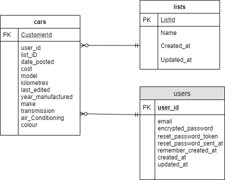
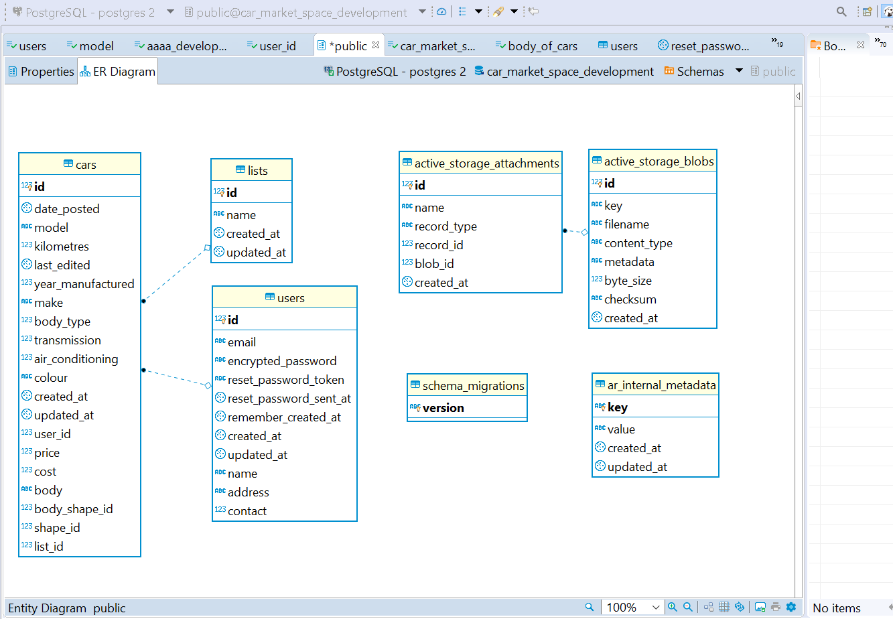
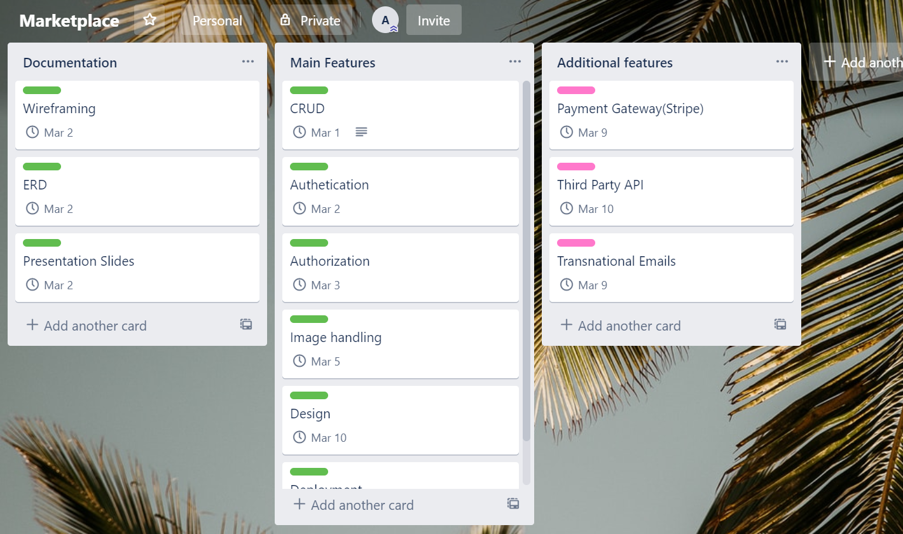
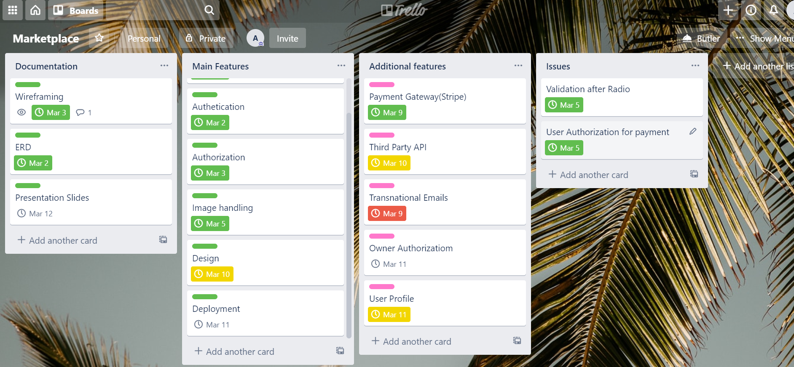
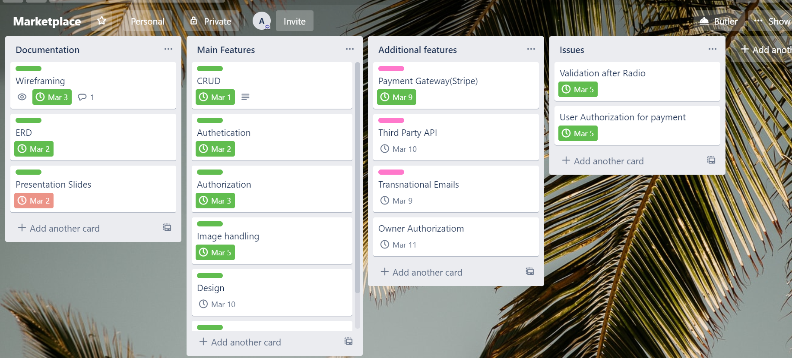

# **Introduction**
This is a market place application for buyers and sellers of cars. Since online shopping is quite popular these days (efficient as well), most of the people would like to look online for shopping whether it is headphones or laptop. In order to make it easy for the buyers and sellers of personal car, this web application has been designed. Visiting this application, a user can register oneself and then buy a car posted by other users. Also, a user can post an advertisement of his/her car. In addition, non-registered users can see the car lists and the car details.

# **Issue with current car marketplace applications and Motivation**
Even though we have so many market place applications like Ebay, Amazon and gumtree, Ebay and Amazon are not suitable for car sales as they are general purpose online marketplace application. Also, people can post car advertisements in gumtree which we can see quite often, but, they can't make the payment via gumtree. So, I decided to design a marketplace application so that it is specialized in cars only and a user can also buy the car online by making online payment.

# **Description of the application**
### **Purpose**: 
The sole purpose of this web application is to facilitate the user in order to buy or sell personal vehicles of different models, make, body and otehr features. This is the age og smart shopping and nobody wants to waste too much time doing so. So, this application has been solely focussed towards designing a smart car marketplace so that people can buy/sell cars without much hassle and can get legit service for payment as well.

### **Functionality / features:**
 A user is capable of chosing a car from the lists of acars put on the adverstisement. The main features include the following:

a. listing a car in advertisement via a form which contains different input fields for the creation of a new list of car.

b. The user can upload image of the car as well via active storage and the use of AWS S3 bucket.

c. The user can buy the car he/she likes via online payment redirecting to stripe gateway.

d. Search Engine: The user can filter cars on the basis of make, model, cost and body type.

e. Dropdown list for body-type makes it easy to view different shapes of car and select the desired one.

# **Sitemap:**
The overall site map for the application is presented below:

# **Screenshots**
The screenshots of various pages of the web application is presented below:

# **Target audience**
This marketplace application is for all the buyers and sellers of cars (specifically personal use). Obviously, since cars are mostly used by adults, adults are the target audience (24 - 55 years old). So all the people who use private vehicle are targetted regarding the the design of this application.

# **Tech stack applied in the application**
The application uses .html.erb, Scss, bootstrap for the frontend related tasks. For the backend purpose, it uses Ruby on Rails and Psotgresql. Git has been used for version control and Heroku is the deployment platform for this application. Apart from these, Stripe and Aws have been called upon for payment and S3 bucket (backup for images) respectively.

# **User Stories**

AS a user, I would like to have the following features in the car market place application.

a. If I want to buy a car, I would like to view all the cars that are listed by other user.

b. Again as a buyer, I would like to view the details and picture of all the cars listed.

c. As a buyer, I would like to pay for the car I like online and get my car delivered.

d. As a seller, I would like to post a car for sale, edit and delete the post whenever I like.

e. As a seller, I would like to get paid online and deliver the vehicle to the buyer. 

f. As a seller, nobody other than me should edit or delete my post.

# **An ERD for the  application**

The entity relationship diagram of the application is presented below:

# **Wireframes**

# **High-level components (abstractions) in the appication**
Following are the high-level compomnents in mu car_marekt_space application:
**a. Cars:**
This component includes the details of a car put on the advertisement list. It is actually the list of cars added to the list of cars.

**Users:**
Users are all those people who are registered as a member in the application. In this case, all the people who want to put their car on advertisement and those who want to buy one of the listed cars are users.

**lists:**
This component is associated with the body-types of cars. Different body types are fed to the table named lists which may be Sedan, Suv, Ute, Mini-Vans etc.

**Active Storage attachments: and blobs**
This storage is for enabling the user to upload photo from her/his own storage. Moreover, a user can have a bucket in amazon and store the picture over there.

# **Third party services that the app will use**
The major third parties involved are:
#### **a. Amazon (AWS)**
Aws is used for creating S3bucket for storing the pictures that users upload during creating the car list. The scces is provide after the secret and public keys are included in relevant application file.
#### **b. Stripe** 
This application uses Stripe for payment gateway. When a user is logged in and wants to [urchase a car of his/her choice, payment can be made via Stripe and the user is required to have all the credit/debit card details in order to make the payment and purchase the desired car. Any guest users are not capable of buying the listed car despite being able to view the car.
#### **c. Heroku**
Heroku is used for the deployment of the application.
#### **d. Github**
Github is used for stroing the codes as a backup as well as deployment via Heroku. 

## **projects models in terms of the relationships (active record associations) they have with each other**
In this marketplace application, following are the different model entities:
a. Car
b. User
c. List

Car is the most important model in this app and it is associated with user and List. List is for storing different body types of cars like Sedan, Suv, Ute and much more. 

A list belongs to a user and a user have zero or multiple cars. 
A list has many cars and a car belongs to one list only.

Also, for enabling the user to use active storage via AWS bucket, there are two tables named active_storage_attachments and active_storage_blobs.

# **Discuss the database relations  implemented in the application**
This application uses Postgresql and Ruby on Rails. The relations used in this database are:
#### **One Mandatory to Many Optional:**
In the database of this application, there is only one type of relation, i.e, one mandatory to many optional. AS can be seen from the ERD, a car belongs to at least one user but a user can exist without a car in the listing. Also, a user can post more than one car.
Similar relation exists between the user and the cars listed. When active storage is used, the same i,e, one mandatory to mamy optional exists between the storage and blobs, storage being mandatory and blob as optional.

# **Database schema design for the application**

The actual database schema design for the apllication as seen in dbeaver is as below:

# **Describe the way tasks are allocated and tracked in your project**

I have used Trello as a project management tool for managing the car marketplace application. I've devided the features as mandatory (donuts) and additional (sprinkles). The screenshots of trello as the project was continuously tracked, have been attached below:

Date: 28/02/2020

Date: 03/03/2020

Date: 05/03/2020

Date: 10/03/2020

This README would normally document whatever steps are necessary to get the
application up and running.

Things you may want to cover:

* Ruby version

* System dependencies

* Configuration

* Database creation

* Database initialization

* How to run the test suite

* Services (job queues, cache servers, search engines, etc.)

* Deployment instructions

* ...
